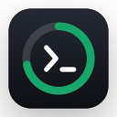
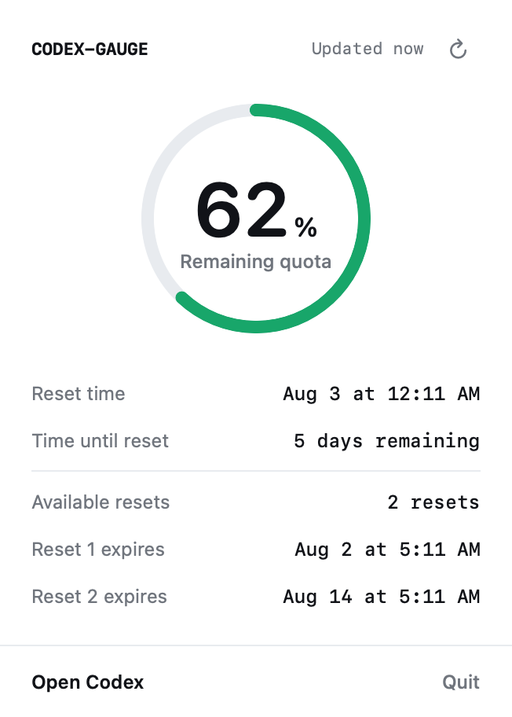

<p align="center">
  
</p>

<h1 align="center">Codex Gauge</h1>

<p align="center">
  A lightweight native macOS menu bar app for checking Codex usage limits at a glance.
</p>

<p align="center">
  English · <a href="README.zh-CN.md">简体中文</a>
</p>

Codex Gauge shows your 5-hour and weekly Codex quotas, their reset times, and available usage-limit reset credits without requiring you to open Codex. The menu bar prefers the 5-hour remaining percentage and automatically falls back to another available window, while the popover provides detailed status in your local time zone.

> Codex Gauge is a community project and is not an official OpenAI product.

<p align="center">
  
</p>

<p align="center"><sub>Preview uses simulated data.</sub></p>

## Features

- Displays the 5-hour remaining quota directly in the menu bar, with an automatic fallback when that window is unavailable.
- Shows both 5-hour and weekly percentages and reset times when Codex provides both windows.
- Shows available reset credits and their expiration details.
- Refreshes on launch, on demand, when Codex reports an update, and periodically in the background.
- Keeps the most recent successful snapshot when a refresh temporarily fails.
- Automatically locates Codex installed through `PATH`, Homebrew, Codex, or ChatGPT.
- Lets you select the `codex` executable manually when automatic discovery fails.
- Runs as a menu bar utility without a Dock icon and supports a clean quit action.

## How it works and privacy

Codex Gauge starts the local command below and reads quota data through its stdio protocol:

```sh
codex app-server --stdio
```

It calls `account/rateLimits/read` and reuses the sign-in state already managed by Codex. The app does not read credential files, copy tokens, ask for an API key, scrape web pages, record complete protocol responses, or retain account email addresses and reset-credit identifiers.

The app-server quota interface is experimental and may change in future Codex versions. Codex Gauge performs runtime capability checks and keeps the last valid snapshot when the interface is temporarily unavailable.

## Requirements

- Apple Silicon Mac (`arm64`).
- macOS 14 or later.
- Codex App or Codex CLI installed and signed in with an account that exposes Codex subscription limits.

## Install

1. Download `CodexGauge-<version>-arm64.dmg` from the [latest release](https://github.com/yzy9527/codex-gauge/releases/latest).
2. Open the DMG and drag `CodexGauge.app` into Applications.
3. Launch Codex Gauge.
4. If macOS blocks the first launch, open **System Settings → Privacy & Security**, scroll to Security, click **Open Anyway**, and confirm.

Current releases use ad-hoc signing and are not notarized by Apple because the project does not use an Apple Developer Program account. After the one-time Gatekeeper confirmation, the app can be opened normally. Managed Macs may prevent users from overriding this security policy.

## Verify a download

Download the DMG and its `.sha256` file into the same directory, then run:

```sh
shasum -a 256 -c CodexGauge-0.1.0-arm64.dmg.sha256
```

Public-repository releases also include GitHub build provenance. With GitHub CLI installed:

```sh
gh attestation verify CodexGauge-0.1.0-arm64.dmg \
  -R yzy9527/codex-gauge
```

## Build from source

Open `CodexGauge.xcodeproj` in Xcode 16 or later, select the `CodexGauge` scheme and **My Mac**, then press `Command-R`.

Command-line build:

```sh
xcodebuild \
  -project CodexGauge.xcodeproj \
  -scheme CodexGauge \
  -configuration Debug \
  -destination 'platform=macOS' \
  build
```

Run the test suite:

```sh
swift test
```

## Build a DMG

```sh
./scripts/build-release.sh 0.1.0
```

Artifacts are written to `dist/`. Without `CODESIGN_IDENTITY`, the app is signed ad-hoc and the DMG is not submitted to Apple for notarization.

To regenerate the app icon assets:

```sh
xcrun swift \
  -module-cache-path /tmp/codex-gauge-icon-cache \
  scripts/generate-app-icon.swift \
  Resources/Assets.xcassets/AppIcon.appiconset
```

## Release process

Pushing an annotated semantic-version tag triggers `.github/workflows/release.yml`:

```sh
git tag -a v0.1.0 -m "Codex Gauge v0.1.0"
git push origin v0.1.0
```

GitHub Actions runs the tests, builds and verifies the ad-hoc signed `arm64` DMG, generates a SHA-256 file, and publishes both files to GitHub Releases. Public repositories also receive a build-provenance attestation. This workflow uses the automatically provided `GITHUB_TOKEN` and requires no Apple signing or notarization secrets.

If Developer ID distribution is added in the future, set `CODESIGN_IDENTITY` and `DEVELOPMENT_TEAM` during the build, then notarize the signed DMG with `scripts/notarize-release.sh`.

## License

Codex Gauge is available under the [MIT License](LICENSE).
